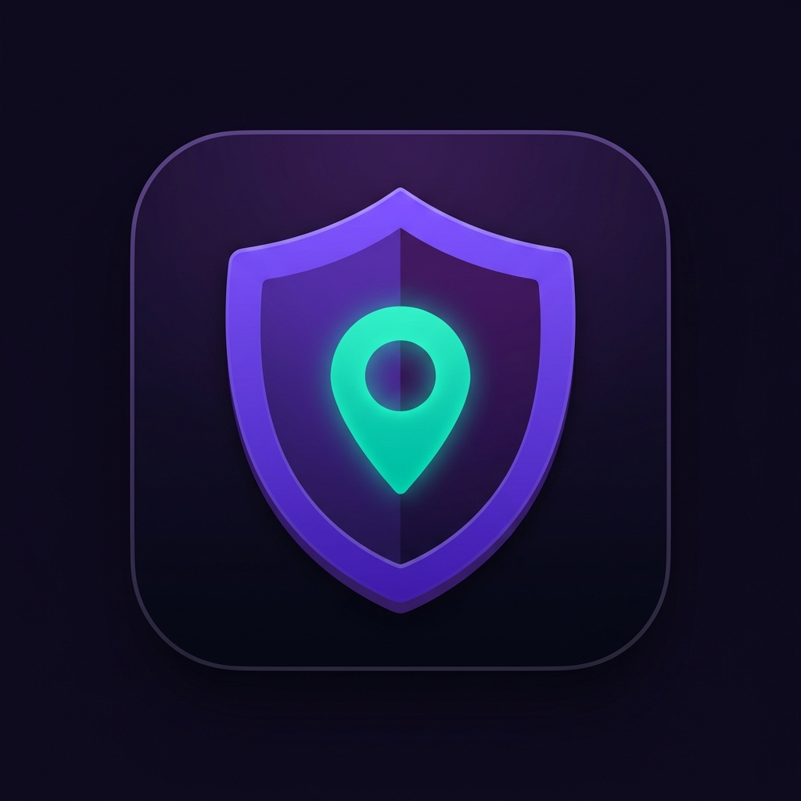

# 🛡️ RakshaSetu

**RakshaSetu** is a comprehensive, mobile-first Progressive Web App (PWA) designed to provide real-time safety tools for women. Built with speed and reliability in mind, it works offline-first and offers discreet, instant access to critical emergency functions.



### 🌍 Live Demo
**[Launch RakshaSetu on Netlify](https://rakshasethu.netlify.app/)**  
*(Note: If your Netlify URL is different, update this link!)*

---

## 🚀 Key Features

*   🚨 **One-Tap SOS Alert:** Hold the SOS button for 3 seconds to instantly trigger an alarm, begin audio recording, and dispatch emergency alerts.
*   📍 **Live Location Tracking:** Broadcasts your real-time GPS coordinates via a live map link to your trusted contacts using Leaflet.js.
*   📱 **SMS & Email Notifications:** Automatically notifies your Emergency Contacts with your exact location and a distress message via Twilio and EmailJS.
*   🧮 **Stealth Mode:** Disguises the app as a functioning calculator. Entering the secret code (`911=`) instantly triggers an SOS without revealing the app's true nature.
*   📞 **Fake Call:** Simulates an incoming call (with realistic ringtones and answer screens) to help you safely exit uncomfortable situations.
*   🚶‍♀️ **Safe Walk Planner:** Enter your destination and ETA. If you fail to check in before the timer expires, an SOS alert is automatically triggered.
*   🎙️ **Auto-Recording Evidence:** Automatically starts capturing audio when an SOS is triggered. When the SOS ends, the audio file (`.webm`/`.ogg`) is securely downloaded to your device for evidence.
*   ✅ **Safety Check-ins:** Schedule automated prompts asking if you are safe. Escalates to an SOS if ignored.

---

## 🛠️ Technology Stack

*   **Frontend Shell:** HTML5, CSS3 (Custom Glassmorphism Design System)
*   **Logic:** Vanilla JavaScript (ES6+)
*   **Architecture:** Progressive Web App (PWA) with Service Workers (`sw.js`) for offline caching and standalone installation.
*   **Mapping:** Leaflet.js with OpenStreetMap tiles.
*   **APIs:** Native Geolocation API, MediaRecorder API, Vibration API, Web Audio API.
*   **External Services:** EmailJS (Email Alerts), Twilio REST API (SMS Alerts).

---

## ⚙️ Installation & Setup

To run RakshaSetu locally and enable full alert functionality:

1. **Clone the repository:**
   ```bash
   git clone https://github.com/hrishikesh-arch/Rakshasethu.git
   cd Rakshasethu
   ```

2. **Configure API Keys:**
   Open `config.js` and replace the placeholder values with your own API credentials:
   *   **EmailJS:** Get keys from [emailjs.com](https://www.emailjs.com) to enable email alerts.
   *   **Twilio:** Get Account SID, Auth Token, and a phone number from [twilio.com](https://www.twilio.com) for SMS alerts.

3. **Run a local server:**
   Because the app requires secure contexts (for Microphone and Geolocation APIs), serve it locally using:
   ```bash
   npx serve .
   ```
   *Navigate to `http://localhost:3000` in your browser.*

---

## 🔒 Privacy First
RakshaSetu is designed with a strict privacy-first architecture. All profile data, emergency contacts, and settings are stored locally on your device via `localStorage`. No personal data is stored on external databases unless explicitly broadcasted during an active SOS emergency.

---
*Stay Safe. Stay Empowered.*
